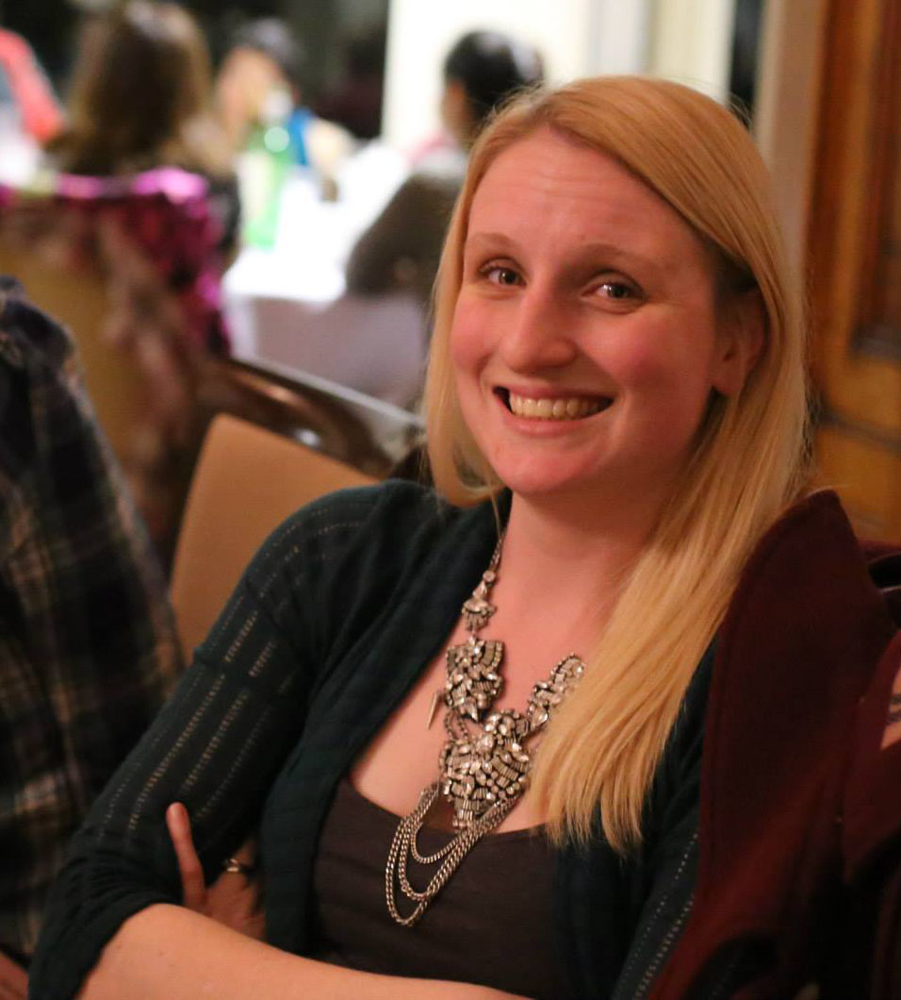

| <a href="./projects/index.md">Projects</a>  | [Workshops](./workshops/index.md) | [About Me](./CV/index.md) |

Based at the [Centre for Genome Enabled Biology and Medicine](http://www.abdn.ac.uk/genomics/), University of Aberdeen, UK, I collaborate with and offer support to researchers analysing sequencing data. Applications include RNA sequencing, genome assembly, microbial community analysis and variant calling. I also coordinate and assist with a number of workshops, enabling researchers to take more control in their own data analysis. 

